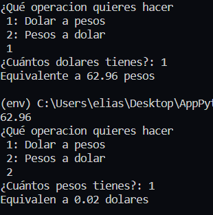

## Pesos Argentinos - Dolar Converter with Dolarsi API

This code use this:
https://www.dolarsi.com/api/api.php?type=valoresprincipales

### Preview

<div align="center">
  
  <small>Arquitectura</small>
</div>

### How to run

`python -m venv env`

```bash
cd env/Scripts
activate
pip install -r requirements.txt
```

`python main.py`